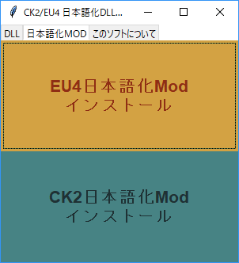

# Simple Installer

## Overview


Install [eu4dll](https://github.com/matanki-saito/EU4dll) or [ck2dll](https://github.com/matanki-saito/CK2dll) on your PC.
 - Installer sees Steam's settings.
 - Installer will find the directory where eu4/ck2 is installed.
 - Put the dll there.

Install jp-mods and mod-downloader
 - Put the mod-downloader and mods there.

## Build
### Requirement
 - windows 10 or later
 - python 3.7 or later
 - pyinstaller ```pip install pyinstaller```
### command

```
pyinstaller ./angelica.py -n installer --onefile --noconsole --icon=./icon.ico
```

## Usage
 Just click the button !
 
## Licence
 - [MIT](https://github.com/tcnksm/tool/blob/master/LICENCE)
